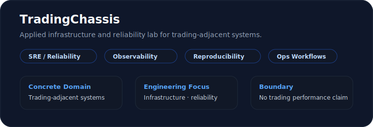
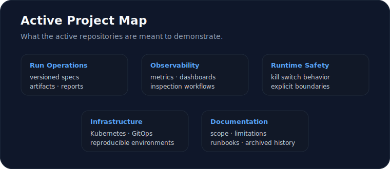

# TradingChassis

TradingChassis is an applied infrastructure and reliability lab for trading-adjacent systems.

It uses a trading domain to explore SRE, observability, reproducibility, operational workflows, and failure-aware infrastructure design.

  

## Current Direction

 

 

The current direction is focused on **small, understandable proof-of-skill systems**.

The goal is to demonstrate infrastructure and reliability engineering discipline in a concrete domain, not to build a production trading platform.

## Active Work

| Repository | Status | Role |
| --- | --- | --- |
| [`tradingchassis-ops-lab`](https://github.com/TradingChassis/tradingchassis-ops-lab) | Active / Primary | Local-first operations lab around NautilusTrader for reproducible backtest and paper-run workflows. |
| [`infrastructure`](https://github.com/TradingChassis/infrastructure) | Active / Foundation | Kubernetes, GitOps, observability, environment management, and operational infrastructure. |
| [`infrastructure-secrets`](https://github.com/TradingChassis/infrastructure-secrets) | Supporting | Secret-management integration work for Kubernetes-based infrastructure workflows. |

## Active Project Map

  

## Archived Work

Earlier repositories explored a custom trading-engine architecture.  
That direction is preserved as historical context, but it is no longer the active implementation path.

| Repository | Status | Notes |
| --- | --- | --- |
| [`core`](https://github.com/TradingChassis/core) | Archived / Legacy | Historical exploration of deterministic event-driven trading decision semantics. |
| [`core-runtime`](https://github.com/TradingChassis/core-runtime) | Archived / Legacy | Historical runtime and orchestration layer for the previous Core architecture. |
| [`docs`](https://github.com/TradingChassis/docs) | Archived / Legacy | Historical documentation archive for architecture, concepts, ADRs, operations, and project evolution. |

## Boundaries

TradingChassis is intentionally scoped as a portfolio-style engineering lab.

It is not a trading bot, strategy library, alpha research project, or claim of trading performance.

The focus is infrastructure discipline: reproducibility, observability, operational clarity, safety boundaries, and failure-aware workflows.

For technical details, use the individual repository READMEs, documentation, issues, and discussions.

 

 

## Contributing and Contact

Contributions, feedback, and technical discussion are welcome around infrastructure, reliability engineering, observability, reproducibility, operational workflows, and trading-adjacent systems.

See [CONTRIBUTING.md](https://github.com/TradingChassis/.github/blob/main/CONTRIBUTING.md) for guidance.

For project inquiries, use the relevant repository discussions or issues.
