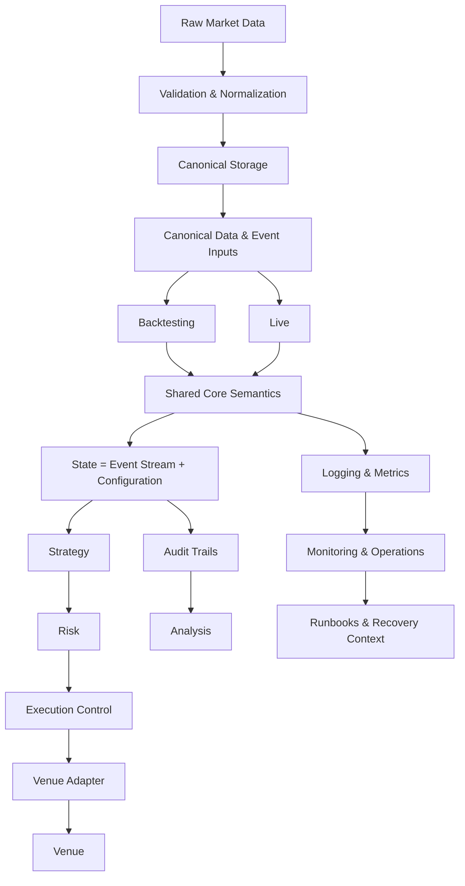

# TradingChassis

Open-source infrastructure for deterministic, reproducible, observable, and auditable trading systems.

TradingChassis is an open-source trading infrastructure project for building professional Research-to-Production trading systems. It focuses on the infrastructure layer that trading firms usually build internally: canonical data flows, deterministic Event processing, versioned Configuration, reproducible Research, audit trails, structured logging, monitoring, Operations, scalable orchestration, and explicit architecture documentation.

The goal is not to provide another trading bot or Strategy collection. The goal is to build the infrastructure discipline required to make trading systems consistent, explainable, maintainable, and operationally reliable.

> **Terminology note:** This README follows the [TradingChassis terminology](https://tradingchassis.github.io/docs/latest/00-guides/terminology/). Capitalized terms are used according to the canonical definitions in the documentation.

---

## 🎯 Why TradingChassis Exists

Successful trading systems are not only about Strategy logic.

They depend on the surrounding infrastructure: how market data is captured and promoted, how Events are ordered, how State is derived, how Configuration is versioned, how Research results are reproduced, how Live behavior is monitored, how operational failures are investigated, and how the system can be audited after the fact.

Many trading projects focus on isolated parts of this problem:

- Strategy logic
- Backtesting
- exchange connectivity
- signal generation
- portfolio notebooks
- execution scripts

TradingChassis approaches this problem as an infrastructure problem.

It aims to provide the kind of Research-to-Production foundation that professional trading teams often build internally, but as an open-source, smaller-scale, explicitly documented system.

---

## 🏗️ What TradingChassis Builds

TradingChassis is organized around a few core infrastructure concerns:

- **Deterministic Event processing**  
State is derived from an Event Stream under Configuration. No hidden mutable truth.
- **Canonical data flows**  
Raw market data is recorded, validated, normalized, and promoted into canonical forms before it is used by Research, Backtesting, Analysis, or Live systems.
- **Research-to-Production continuity**  
Research, Backtesting, Analysis, and Live operation should not be disconnected worlds with different assumptions. They should be different usage contexts of one coherent infrastructure.
- **Versioning and reproducibility**  
Data, Configuration, code, runtime context, and results should be traceable enough to explain what was run, why it behaved as it did, and how it can be reproduced.
- **Auditability by design**  
Important decisions and State Transitions should be reconstructible from canonical inputs, not inferred from scattered logs or hidden runtime state.
- **Observability and Operations**  
Logging, metrics, monitoring, Runbooks, operational procedures, and recovery context are part of the infrastructure, not an afterthought.
- **Scalable orchestration**  
The project is designed with deployment, environment management, Kubernetes, GitOps-style workflows, secret management, and operational boundaries in mind.
- **Explicit architecture documentation**  
Architecture, concepts, ADRs, Stack documents, and operational models are maintained as first-class engineering artifacts.

---

## 🔁 Infrastructure Workflow

The diagram is intentionally high-level. The Documentation repository defines the canonical terms and the detailed architecture.

---

## ✅ What This Is

TradingChassis is:

- trading infrastructure
- Research-to-Production architecture
- a deterministic Event-driven Core model
- a canonical data and State derivation discipline
- an operational foundation for professional trading systems
- a modular infrastructure project with explicit Stack boundaries
- a documentation-heavy engineering project
- an attempt to make professional trading infrastructure discipline available in open source

---

## 🚫 What This Is Not

TradingChassis is not:

- a trading bot
- a signal library
- a Strategy marketplace
- a plug-and-play exchange bot
- a retail algo-trading starter kit
- a collection of profitable Strategies
- a promise of trading performance
- a notebook-only Backtesting framework

The project is intentionally focused on infrastructure, not on selling Strategies or simplifying trading into buy/sell signals.

---

## 👥 Who This Is For

TradingChassis is intended for people interested in the infrastructure behind systematic trading systems:

- Quantitative Developers
- Research Engineers
- Trading infrastructure Engineers
- systematic traders with strong engineering background
- Data Platform Engineers working with market data
- engineers interested in market microstructure
- engineers interested in deterministic Event-driven systems
- people working on reproducible Research-to-Production workflows
- small trading, research, or prop-oriented teams that care about operational discipline

It is especially relevant if you think the hard part is not only testing a Strategy once, but building the system around it: data, State, execution semantics, observability, auditability, reproducibility, deployment, and operations.

---

## 🚫👥 Who This Is Not For

TradingChassis is not the right starting point if you are looking for:

- a ready-made retail trading bot
- a simple “connect exchange and trade” script
- copy-paste Strategies
- buy/sell signals
- a beginner-friendly algo-trading course
- a quick way to automate discretionary trades
- a black-box system that hides architecture and operational details

The project deliberately exposes architecture, semantics, and operational boundaries instead of hiding them.

---

## 📦 Repositories

| Repository                                                                         | Role                                                                                                                                                                                                                 |
| ---------------------------------------------------------------------------------- | -------------------------------------------------------------------------------------------------------------------------------------------------------------------------------------------------------------------- |
| [Core](https://github.com/TradingChassis/core)                                     | The deterministic Event-driven engine. It applies the Event Stream, derives State, invokes Strategy, applies Risk, and runs Execution Control as part of Event processing.                                           |
| [Core Runtime](https://github.com/TradingChassis/core-runtime)                     | Runtime environments for running the Core in Research, Backtesting, and Live contexts. Runtimes share the same semantic model while differing in data sources, Venue implementation, and surrounding infrastructure. |
| Data (work in progress)                                                            | Data infrastructure for recording raw market data, validation, normalization, promotion, provenance, and Canonical Storage.                                                                                          |
| [Infrastructure](https://github.com/TradingChassis/infrastructure)                 | Kubernetes deployment, environment management, orchestration, and operational tooling for running infrastructure Components.                                                                                         |
| [Infrastructure Secrets](https://github.com/TradingChassis/infrastructure-secrets) | Secret management and Vault integration for Kubernetes-based environments, including OCI secrets and Secrets Store CSI integration.                                                                                  |
| [Documentation](https://github.com/TradingChassis/docs)                            | The authoritative reference for architecture, canonical concepts, ADRs, Stack documents, operations, and project evolution.                                                                                          |

---

## 🧩 How the Repositories Fit Together

TradingChassis is structured as a set of related infrastructure repositories rather than a single monolithic application.

The Data repository records and promotes market data into canonical forms. 

The Core repository defines the deterministic semantics for Event processing, State derivation, Strategy evaluation, Risk, Execution Control, and Venue interaction. 

The Core Runtime repository provides environments in which the Core can run across Backtesting and Live contexts. 

The infrastructure repositories provide deployment, orchestration, secrets, and operational foundations. 

The Documentation repository defines the conceptual and architectural model that keeps these pieces aligned.
It is not secondary material, but part of the infrastructure.

---

## 📚 Documentation

The full technical documentation is maintained at:

**[TradingChassis Documentation](https://tradingchassis.github.io/docs/latest/)**

The documentation covers:

- **Architecture** — structure, logical and physical views, and Architecture Decision Records
- **Concepts** — canonical semantic models such as Event, Event Stream, Configuration, State, Determinism, Intent, Risk, Execution Control, Order, Runtime, and Invariants
- **Stacks** — implementation-facing views of infrastructure areas such as Data Recording, Data Quality, Data Storage, Backtesting, Live, Analysis, and Monitoring
- **Operations** (work in progress) — operational monitoring, runbooks, recovery context, and maintenance procedures
- **Evolution** — roadmap, milestones, development logs, and architectural progress

Concept documents define semantics. Stack documents explain how those semantics are realized. Operations documents explain how the infrastructure is used, maintained, monitored, and recovered.

---

## 🧠 Working Principles

### Infrastructure before Strategy shortcuts

TradingChassis is built around the belief that professional trading requires infrastructure discipline before Strategy convenience.

A Strategy is only one Component in a larger system. Data quality, deterministic processing, reproducibility, observability, auditability, deployment are equally important.

### Determinism is non-negotiable

Given the same Event Stream and the same Configuration, the infrastructure must derive the same State at every Processing Order position.

Runtime behavior must not depend on hidden mutable truths, wall-clock side effects, scheduler timing, or uncontrolled concurrency.

### Events are the source of State Transitions

State changes only through Events processed under Configuration.

State is not an independent source of truth. It is a deterministic projection from canonical inputs.

### Canonical semantics come before implementation details

Core concepts such as Event, Event Stream, Configuration, State, Intent, Risk, Execution Control, Order, Runtime, Stack, and Component are defined explicitly.

Implementations realize these concepts; they do not redefine them locally.

### Research, Backtesting, and Live belong to one infrastructure

Backtesting is part of Research. Live is a different operational context, not a different conceptual universe.

The goal is to reduce structural divergence between Research, Backtesting, Analysis, and Live by making them depend on shared infrastructure semantics.

### Observability and auditability are design requirements

Logs, metrics, monitoring, audit trails, and run metadata are not afterthoughts. They are required for understanding, debugging, reproducing, and operating trading systems.

### Operations are part of the product

Runbooks, recovery procedures, deployment models, secret management, monitoring, and operational boundaries are part of the infrastructure.

A trading system is not complete just because it can run. It must also be maintainable, observable, recoverable, and explainable.

### Architecture is a first-class artifact

TradingChassis documents not only what is implemented, but why it is structured this way.

Architecture documents, ADRs, concept definitions, Stack documents, and operational documentation are maintained with the same seriousness as code.

---

## 🚧 Current Status

TradingChassis is under active development.

The current focus is on stabilizing the architectural foundation, canonical concepts, Runtime semantics, documentation structure, infrastructure boundaries, and operational model before expanding higher-level user-facing workflows.

The project is intentionally architecture-first and infrastructure-first.

---

## 🤝 Contributing and Contact

Contributions, feedback, and technical discussion are welcome, especially around trading infrastructure, deterministic systems, market data, Research-to-Production workflows, observability, reproducibility, and operations.

See [CONTRIBUTING.md](https://github.com/TradingChassis/.github/blob/main/CONTRIBUTING.md) in the Documentation repository for contribution guidance.

For broader project inquiries, use the relevant repository discussions or issues.
