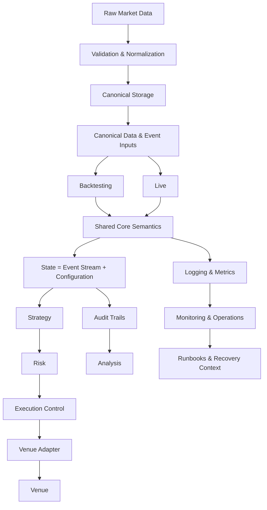

# TradingChassis

TradingChassis is an open-source trading infrastructure project for building small-scaled professional-adjacent Research-to-Production trading systems. 

It addresses infrastructure problems that arise when building such systems: data pipelines, deterministic Event processing, versioned Configuration, reproducible Research, audit trails, structured logging, monitoring, Operations, scalable orchestration, explicit architecture documentation. The goal is not to provide another trading bot or Strategy collection, but rather to approach the infrastructure discipline required to make trading consistent, explainable, maintainable, and operationally reliable. 

Successful trading is not only about Strategy logic. It depends on the surrounding infrastructure: how market data is captured and promoted, how Events are ordered, how State is derived, how Configuration is versioned, how Research results are reproduced, how Live behavior is monitored, how operational failures are investigated, how trading can be audited after the fact.

Many trading projects focus on isolated parts:

- Strategy logic
- Backtesting
- exchange connectivity
- signal generation
- portfolio notebooks
- execution scripts

This project uses some of these isolated parts, while adding its own integration to form a coherent infrastructure. It is production-like but not fully production-grade; it is a solo-maintained setup built to approximate professional standards.

> **Terminology note:** This README follows the [TradingChassis terminology](https://tradingchassis.github.io/docs/latest/00-guides/terminology/). Capitalized terms are used according to the canonical definitions in the documentation.

## Infrastructure Workflow

This diagram is intentionally high-level. It shows how infrastructure fits together to create a Research-to-Production workflow. Terms and detailed architecture are defined in the [documentation](#documentation).

## What It Is

TradingChassis is:

- trading infrastructure
- Research-to-Production architecture
- a deterministic Event-driven Core model
- a canonical data and State derivation discipline
- a modular infrastructure project with explicit Stack boundaries
- a documentation-heavy engineering project

## What It Is Not

TradingChassis is not:

- a signal or Strategy library
- a plug-and-play exchange bot
- a promise of trading performance
- a notebook-only Backtesting framework
- a beginner-friendly algo-trading course
- a quick way to automate discretionary trades

This project is intentionally focused on infrastructure, not on selling Strategies or simplifying trading into buy/sell signals.  
It deliberately exposes architecture, semantics, and operational boundaries.

## Who It Is For

TradingChassis is intended for:

- trading infrastructure engineers
- traders with strong engineering background
- people working with
    - market data
    - market microstructure
    - deterministic systems
    - reproducible workflows

It is especially relevant for not only testing a trading Strategy once, but building around it: data, State, execution semantics, observability, auditability, reproducibility, deployment, operations.

## Repositories

TradingChassis is structured as a set of related infrastructure repositories rather than a single monolithic application:

| Repository | Role |
| ----------------- | ----------------- |
| [Documentation](https://github.com/TradingChassis/docs) | The authoritative reference for architecture, canonical concepts, ADRs, Stack documents, operations, and project evolution. |
| [Core](https://github.com/TradingChassis/core) | The deterministic Event-driven engine. It applies the Event Stream, derives State, invokes Strategy, applies Risk, and runs Execution Control as part of Event processing. |
| [Core Runtime](https://github.com/TradingChassis/core-runtime) | Runtime environments for running the Core in Backtesting and Live contexts. Runtimes share the same semantic model while differing in data sources, Venue implementation, and surrounding infrastructure. Live Runtime support is work in progress. |
| [Infrastructure](https://github.com/TradingChassis/infrastructure) | Kubernetes deployment, environment management, orchestration, and operational tooling for running infrastructure Components. |
| [Infrastructure Secrets](https://github.com/TradingChassis/infrastructure-secrets) | Secret management and Vault integration for Kubernetes-based environments, including OCI secrets and Secrets Store CSI integration. |

<!-- | Data | Data infrastructure for recording raw market data, validation, normalization, promotion, and provenance. This repository is work in progress. | -->

## <h2 id="documentation">📚 Documentation</h2>

The full technical documentation is maintained at:

**[TradingChassis Documentation](https://tradingchassis.github.io/docs/latest/)**

The documentation covers:

- **Architecture** — structure, logical and physical views, and Architecture Decision Records
- **Concepts** — canonical semantic models such as Event, Event Stream, Configuration, State, Determinism, Intent, Risk, Execution Control, Order, Runtime, and Invariants
- **Stacks** — implementation-facing views of infrastructure areas such as Data Recording, Data Quality, Data Storage, Backtesting, Live, Analysis, and Monitoring
- **Operations** (work in progress) — operational monitoring, runbooks, recovery context, and maintenance procedures
- **Evolution** — roadmap, milestones, development logs, and architectural progress

Concept documents define semantics. Stack documents explain how those semantics are realized. Operations documents explain how the infrastructure is used, maintained, monitored, and recovered.

## What TradingChassis Builds

TradingChassis is organized around the following infrastructure concerns and working principles:

| Concern | What it means |
| --- | --- |
| **Deterministic Event processing** | State is derived from an Event Stream under Configuration. There is no hidden mutable truth. |
| **Canonical data flows** | Raw market data is recorded, validated, normalized, and promoted into canonical forms before it is used by Research, Backtesting, Analysis, or Live systems. |
| **Research-to-Production continuity** | Research, Backtesting, Analysis, and Live operation should not be disconnected worlds with different assumptions. They should be different usage contexts of one coherent infrastructure. |
| **Versioning and reproducibility** | Data, Configuration, code, runtime context, and results should be traceable enough to explain what was run, why it behaved as it did, and how it can be reproduced. |
| **Auditability by design** | Important decisions and State Transitions should be reconstructible from canonical inputs, not inferred from scattered logs or hidden runtime state. |
| **Observability and Operations** | Logging, metrics, monitoring, Runbooks, operational procedures, and recovery context are part of the infrastructure. |
| **Scalable orchestration** | Deployment, environment management, Kubernetes, GitOps-style workflows, secret management, and operational boundaries are treated as infrastructure concerns. |
| **Explicit architecture documentation** | Architecture, concepts, ADRs, Stack documents, and operational models are maintained as first-class engineering artifacts. |

| Principle | What it means |
| --- | --- |
| **Architecture is a first-class artifact** | TradingChassis documents not only what is implemented, but why it is structured this way. Architecture documents, ADRs, concept definitions, Stack documents, and operational documentation are maintained with the same seriousness as code. |
| **Infrastructure before Strategy shortcuts** | Professional trading requires infrastructure discipline before Strategy convenience. A Strategy is only one Component in a larger system; data quality, deterministic processing, reproducibility, observability, auditability, and deployment are equally important. |
| **Determinism is non-negotiable** | Given the same Event Stream and the same Configuration, the infrastructure must derive the same State at every Processing Order position. Runtime behavior must not depend on hidden mutable truths, wall-clock side effects, scheduler timing, or uncontrolled concurrency. |
| **Events are the source of State Transitions** | State changes only through Events processed under Configuration. State is not an independent source of truth, but a deterministic projection from canonical inputs. |
| **Canonical semantics come before implementation details** | Core concepts such as Event, Event Stream, Configuration, State, Intent, Risk, Execution Control, Order, Runtime, Stack, and Component are defined explicitly. Implementations realize these concepts; they do not redefine them locally. |
| **Backtesting and Live belong to one infrastructure** | Backtesting is part of Research. Live is a different operational context, but not a different conceptual universe. The goal is to reduce structural divergence between Backtesting and Live by making them depend on shared infrastructure semantics. |
| **Observability and auditability are design requirements** | Logs, metrics, monitoring, audit trails, and run metadata are required for understanding, debugging, reproducing, and operating. |
| **Operations are part of the infrastructure** | Runbooks, recovery procedures, deployment models, secret management, monitoring, and operational boundaries are part of the infrastructure. Trading must also be maintainable, observable, recoverable, and explainable. |

## Current Status

TradingChassis is under active development.

Before expanding to any higher-level workflows, the focus is on stabilizing the architectural foundation, canonical concepts, Runtime semantics, documentation structure, infrastructure boundaries, and operational model.

The [roadmap](https://tradingchassis.github.io/docs/latest/50-evolution/roadmap/) gives the clearest view of where TradingChassis is heading.

## Contributing and Contact

Contributions, feedback, and technical discussion are welcome, especially around trading infrastructure, deterministic systems, market data, Research-to-Production workflows, observability, reproducibility, and operations.

See [CONTRIBUTING.md](https://github.com/TradingChassis/.github/blob/main/CONTRIBUTING.md) for guidance.

For project inquiries, use the relevant repository discussions or issues.
